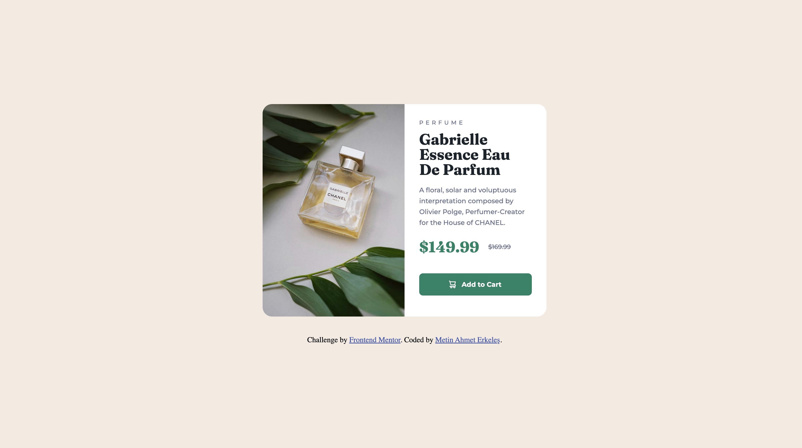

# Frontend Mentor - Product preview card component solution

This is a solution to the [Product preview card component challenge on Frontend Mentor](https://www.frontendmentor.io/challenges/product-preview-card-component-GO7UmttRfa). Frontend Mentor challenges help you improve your coding skills by building realistic projects.

## Overview

### The challenge

Users should be able to:

- View the optimal layout depending on their device's screen size
- See hover and focus states for interactive elements

### Screenshot



### Links

- Solution URL: [https://github.com/metinahmeterkeles/Product-Preview-Card](https://github.com/metinahmeterkeles/Product-Preview-Card)
- Live Site URL: [https://product-preview-card-three-jade.vercel.app/](https://product-preview-card-three-jade.vercel.app/)

## My process

### Built with

- Semantic HTML5 markup
- CSS custom properties
- Flexbox
- Mobile-first workflow

### What I learned

In this challenge, I learned how to add images according to desktop and mobile screens. I also learned exactly how the image inside my container should fit into the container. While coding this design, I first coded it according to the mobile design.

```html
<picture>
  <source
    media="(max-width: 799px)"
    srcset="./images/image-product-mobile.jpg"
    width="343"
    height="240"
  />
  <source
    media="(min-width: 800px)"
    srcset="./images/image-product-desktop.jpg"
    width="300"
    height="450"
  />
  
</picture>
```

```css
.container {
  max-width: 343px;
  max-height: 667px;
  height: 100%;
  background-color: var(--color-white);
  display: flex;
  flex-direction: column;
  overflow: hidden;
  border-radius: 20px;
}
```

### Useful resources

- [https://web.dev/learn/design/picture-element?hl=tr](https://web.dev/learn/design/picture-element?hl=tr) - This site showed me how to change images according to screen size.

## Author

- Website - [https://github.com/metinahmeterkeles](https://github.com/metinahmeterkeles)
- Frontend Mentor - [https://www.frontendmentor.io/profile/metinahmeterkeles](https://www.frontendmentor.io/profile/metinahmeterkeles)
